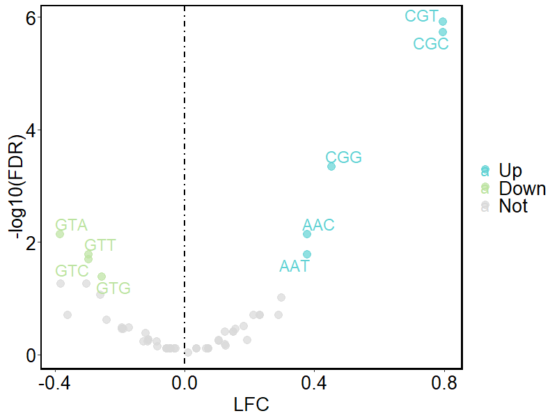
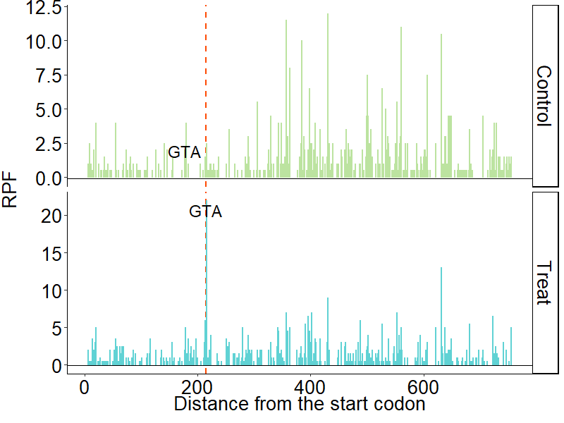
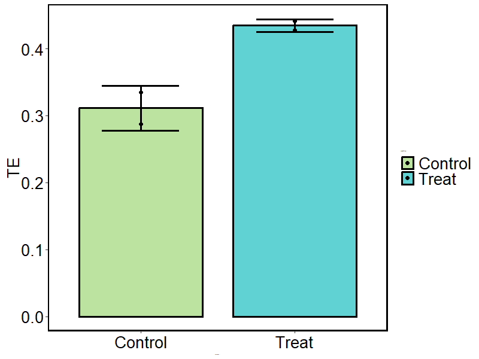

<!-- README.md is generated from README.Rmd. Please edit that file -->


# __TriPScan__

## Table of Contents

* [Overview](https://github.com/cangjie2020/Tripscan#overview)
* [Before Starting](https://github.com/cangjie2020/Tripscan#before-starting)
    - [Dependencies](https://github.com/cangjie2020/Tripscan#dependencies)
    - [Installation](https://github.com/cangjie2020/Tripscan#installation)
    - [Loading the Package](https://github.com/cangjie2020/Tripscan#loading-the-package)
* [Extracting the Genome Information](https://github.com/cangjie2020/Tripscan#extracting-the-genome-information)
    - [Input](https://github.com/cangjie2020/Tripscan#input)
    - [Output](https://github.com/cangjie2020/Tripscan#output)
* [Identifying Codon Differential tRNA-index](https://github.com/cangjie2020/Tripscan#identifying-codon-differential-tRNA-index)
    - [Input](https://github.com/cangjie2020/Tripscan#input-1)
    - [Output](https://github.com/cangjie2020/Tripscan#output-1)
* [Extracting Codon Information at E, P, and A sites](https://github.com/cangjie2020/Tripscan#extracting-codon-information-at-e,-p,-and-a-sites)
    - [Input](https://github.com/cangjie2020/Tripscan#input-2)
    - [Output](https://github.com/cangjie2020/Tripscan#output-2)
* [Identifying Potential Ribosome Stalling Sites Due to tRNA Shortage](https://github.com/cangjie2020/Tripscan#identifying-potential-ribosome-stalling-sites-due-to-tRNA-shortage)
    - [Input](https://github.com/cangjie2020/Tripscan#input-3)
    - [Output](https://github.com/cangjie2020/Tripscan#output-3)
* [Calculating Translation Efficiency of Ribosome Stalling Signal (RSS) Genes](https://github.com/cangjie2020/Tripscan#calculating-translation-efficiency-of-ribosome-stalling-signal-rss-genes)
    - [Input](https://github.com/cangjie2020/Tripscan#input-4)
    - [Output](https://github.com/cangjie2020/Tripscan#output-4)

## Overview

Translation elongation is a critical step in the protein synthesis process, with tRNA being an indispensable component. Abnormalities in tRNA expression can significantly impact ribosome translation speed during elongation. Utilizing tRNA-seq, Ribo-seq and mRNA-Seq data, our package identifies differential ribosome stalling sites associated with variations in tRNA expression during translation elongation. Additionally, we provide tools to calculate changes in translation efficiency for Ribosome Stalling Signal (RSS) genes. By integrated Trio-translatome Profiling for Scanning (__TriPScan__) elongation regulatory events, our package can rapidly and accurately identify Ribosome Stalling Signal genes across the genome, providing valuable insights into the impact of tRNA expression on translation dynamics.

------------------------------------------------------------------------

## Before Starting

### Dependencies

__TriPScan__ requires R version \>= 3.3.0 and the following packages:

    Biostrings(>= 2.70.3)
    data.table(>= 1.15.4)
    DESeq2(>= 1.42.1)
    dplyr(>= 1.1.4)
    GenomicFeatures(>= 1.54.4)
    ggplot2(>= 3.5.1)
    ggrepel(>= 0.9.5)
    NOISeq(>= 2.46.0)
    rtracklayer(>= 1.62.0)
    tidyr(>= 1.3.1)
    
All dependencies are automatically installed running the code in the
next section.

### Installation

You can install the development version of __TriPScan__ from
[GitHub](https://github.com/) with:

``` r
# install.packages("devtools")
devtools::install_github("cangjie2020/TriPScan")
```

### Loading the Package

To load __TriPScan__ run

``` r
library(TriPScan)
```
------------------------------------------------------------------------

## Extracting the Genome Information

Extract information from the GTF annotation file and generate a matrix. This sequence annotation file, containing 14 columns, is essential for these tools. It facilitates the screening of different transcripts of the same gene and aids in calculating the codons corresponding to the E, P, and A sites for each ribosome-protected fragment (RPF).

### Input

`gtf.path` ：Corresponding species gtf annotation file

``` r
geneinfo <- extractGeneInfo( gtf.path = "../Mus_musculus.GRCm39.110.chr.gtf")
```
### Output

`geneinfo`

|  gene_id  |  tx_name  |  tx_id  |  nexon  |  tx_len  |  cds_len  | utr5_len | utr3_len | gene_name | gene_biotype | transcript_biotype | protein_id | chrom | strand |
  |:------:|:-----:|:------:|:------:|:------:|:------:|:------:|:-----:|:------:|:-----:|:------:|:------:|:------:|:------:|
  |  ENSMUSG00000000001  |  ENSMUST00000000001  |  26866  |  9  |  3262  |  1065  |141|  2056  |  Gnai3  |  protein_coding  |  protein_coding  | ENSMUSP00000000001 |3  | - |
|  ENSMUSG00000000003  |  ENSMUST00000000003  |  145808  |  7  |  902 |  525  |140|  237  |  Pbsn  |  protein_coding  |  protein_coding  | ENSMUSP00000000003 |X  | - |
|  ENSMUSG00000000001  |  ENSMUST00000114041  |  145809  |  6  |  697  |  414  |47|  236 |  Pbsn  |  protein_coding  |  protein_coding  | ENSMUSP00000109675 |X  | - |
|  ENSMUSG00000000028  |  ENSMUST00000000028  |  124151  |  20  |  2143  |  1701  |313| 129 |  Cdc45  |  protein_coding  |  protein_coding  | ENSMUSP00000000028 |16  | - |
|  ENSMUSG00000000028  |  ENSMUST00000096990  | 124152  | 18  | 1747  | 1563   |61|  123 |  Cdc45  |  protein_coding  |  protein_coding  | ENSMUSP00000094753 |16  | - |
|  ENSMUSG00000000028  |  ENSMUST00000115585  |  124153  |  5  |  832  |  410 | 422 | 0 |  Cdc45  |  protein_coding  |  protein_coding  | ENSMUSP00000111248 |16  | - |

## Identifying Codon Differential tRNA-index

Utilize mim-tRNAseq or other advanced tRNA expression analysis tools to determine the expression levels of anticodons, as recorded in "Anticodon_counts_raw.txt". Then, taking into account tRNA wobble effects, calculate the expression levels of codons corresponding to these anticodons. These measurements, derived from tRNA-seq data, are termed the tRNA-index of codon. Conclude the section by identifying the differential codon tRNA-index across various groups.

### Input

`AC_count` ： The Anticodon_counts_raw.txt file generated by mim-tRNAseq or other tools.

| Anticodon | Treat1 | Treat2 | Control1 | Control2 | size|
  |:------:|:-----:|:------:|:------:|:------:|:-----:|
  | Mus_musculus_mito_tRNA-Ala-TGC |  34271|	31657|	8914|	8684	|1.0|
| Mus_musculus_mito_tRNA-Arg-TCG|62988|	52991|	10694|	10568|	1.0 |
| Mus_musculus_mito_tRNA-Asn-GTT|26719|	25120|	7417|	7326|	1.0|
| Mus_musculus_mito_tRNA-Asp-GTC|52800|	33492|	7930|	8087|	1.0|
| Mus_musculus_mito_tRNA-Cys-GCA|28791|	24168|	5770|	6396|	1.0|
|Mus_musculus_mito_tRNA-Gln-TTG	|21862	|23500	|6279	|6415	|1.0|


`condition` ：This parameter specifies a list that determines the order of the experimental and control groups in the “Anticodon_counts_raw.txt” file. For example, `condition <- list(N1 = c(1,2), N2 = c(3,4))`  assigns columns 1 and 2 as the experimental group and columns 3 and 4 as the control group.

`replicates` : Indicates whether the tRNA-seq data includes biological replicates. Set `replicates = T` if there are replicates, and `replicates = F`if there are none.

`LFC` : The log-fold change (LFC) for differentially expressed tRNAs between two groups, default is 0.

`Padj` : Threshold for significant differentially expressed tRNAs, default is 0.05.

`color` : Settings for the color scheme of the volcano plot, differentiated by tRNA-index.

``` r
AC_count <- "../Anticodon_counts_raw.txt"
condition <- list(N1 = c(1,2),N2 = c(3,4))
tRNA_res <- diff_AC(AC_count = AC_count,condition = condition,replicates = T)
```

### Output

Calculate the tRNA-index of codon for each dataset listed in the “Anticodon_counts_raw.txt” file. After defining the experimental and control groups, perform differential analyses between these groups.The first three columns of the file represent the anticodon, amino acid, and codon, respectively. Each subsequent column corresponds to a sample, arranged in the same order as specified in the “Anticodon_counts_raw.txt” file.

`tRNA_res[[1]]`


|  Anticodon | AA |Codon| Treat1 | Treat2 | Control1 | Control2 | 
|:------:|:-----:|:------:|:------:|:------:|:-----:|:-----:|
|AAA|Phe|TTT|0.002312578|0.001908306|0.002380757|0.002051268|
|AAC|Val|GTT|0.028820882|0.028331843|0.035323424|0.035521336|
|AAG|Leu|CTT|0.007336867|0.007336867|0.009122034|0.009132332|
|AAT| Ile|ATT|0.015528162|0.016511510|0.015110099|0.012458845|
|ACA|Cys|TGT|0.001952492|0.001995792|0.002308543|0.001814826|
|ACC|Gly|GGT|0.027949406|0.027787390|0.023285067|0.027289718|


For the codon differential tRNA-index matrix, the method of analysis depends on the presence of replicates. if `replicates = TRUE`, DESeq2 is used to perform differential expression analysis and calculate the codon differential tRNA-index. If `replicates = FALSE`, NOISeq is employed for differential expression analysis. Notably, NOISeq utilizes simulation to estimate the false discovery rate (FDR) in the absence of biological replicates, which may reuslt in variability in the FDR with each calculation.

`tRNA_res[[2]]`


| baseMean | log2FoldChange | lfcSE | stat | pvalue | padj | codon | 
|:------:|:-----:|:------:|:------:|:------:|:------:|:------:|
|2161.336|-0.05688517|0.19312714|-0.2945478|0.768339377|0.78864483| TTT
|31985.649|-0.29800067|0.09687794|-3.0760427|0.002097678|0.01678143|GTT |
|8517.411|-0.19405452|0.12812507|-1.5145711|0.129881063|0.33060634|CTT |
|14895.626|0.23128915|0.11953777|1.9348625|0.053007175|0.19861475|ATT|
|2015.648|-0.04796306|0.19618271|-0.2444816|0.806857869|NA|TGT |
|26600.685|0.15006894|0.11640318|1.2892168|0.197322714|0.39464543|GGT |


The codon differential tRNA-index volcano plot, by default, identifies codons as significantly different if their adjusted p-value (Padj) is less than 0.05. In the plot, purple dots represent codons with significantly downregulated tRNA-index in the experimental group compared to the control group. Orange dots denote codons with significantly upregulated tRNA-index, and gray dots indicate codons without significant differences. Users can adjust the Padj and LFC thresholds via the plot parameters.

`tRNA_res[[3]]`



------------------------------------------------------------------------

## Extracting Codon Information at E, P, and A sites

Use riboWaltz with Ribo-Seq data to ascertain the position of the P-site on the transcript for each RPF. Based on these findings, identify the codons corresponding to the E, P, and A sites for each RPF.

### Input
`cdna_path` ： Corresponding species cDNA.fa file (e.g Mus_musculus.GRCm39.cdna.all.fa ).

`reads_psite_list` : A list file generated by the `psite_info` function of riboWaltz.

`reads_psite_list[[1]]`

| transcript | end5 | psite | end3 | length | cds_start | cds_stop | psite_from_start | psite_from_stop | psite_region |
|:------:|:-----:|:------:|:------:|:------:|:------:|:------:|:------:|:------:|:------:|
|ENSMUST00000070533|196|208|224|29|151|2094|57|-1886|cds|
|ENSMUST00000070533|196|208|224|29|151|2094|57|-1886|cds|
|ENSMUST00000070533|196|208|224|29|151|2094|57|-1886|cds|
|ENSMUST00000070533|196|208|224|29|151|2094|57|-1886|cds|
|ENSMUST00000070533|697|709|722|26|151|2094|558|-1385|cds|
|ENSMUST00000070533|933|945|962|30|151|2094|794|-1149|cds|

`geneinfo` : The output from the `geneinfo` function, which is a genome annotation matrix.

`tx_scale` : Determines the transcript selection strategy for genes represented by multiple transcripts. If transcripts were not previously filtered, the transcript with the longest coding sequence (CDS) will be used to represent the gene. If each gene is already mapped to a single transcript, set `tx_scale` to "no". The default setting is "the_longest".

``` r
load("reads_psite_list.rda")
EPA_result<-EPA_res(cdna_path = "../Mus_musculus.GRCm39.cdna.all.fa",reads_psite_list = reads_psite_list,geneinfo,tx_scale ="no")
```

### Output

The output is a list matching the length of `reads_psite_list`. Each entry in the list is a matrix with five columns: transcript name, position of the first base of the P-site on the transcript, and the codons at the E-site, P-site, and A-site, respectively.

`EPA_result[[1]]`


|tx_name|trans.site|E_Codon|P_Codon|A_Codon|
|:------:|:-----:|:------:|:------:|:------:|
|ENSMUST00000070533|208|TTC|ACC|CCG|
|ENSMUST00000070533|208|TTC|ACC|CCG|
|ENSMUST00000070533|208|TTC|ACC|CCG|
|ENSMUST00000070533|208|TTC|ACC|CCG|
|ENSMUST00000070533|709|GGA|GCA|GAT|
|ENSMUST00000070533|1264|ATT|CAG|TTC|


------------------------------------------------------------------------

##  Identifying Potential Ribosome Stalling Sites Due to tRNA Shortage

Integrate the outputs of the `EPA_res` and `diff_AC` functions to calculate diffential peak ratios and identify ribosome stalling peaks. Generate bar plots for genes with significant differential ribosome stalling sites, visually representing these sites across coding sequences (CDS) regions.

### Input
`EPA_path` : Specify a list of `EPA_res` results in the order of the experimental group and the control groups. For example, if `replicates = F`, use `EPA_path <- list(S1 = list(EPA_result[[1]]), S2 = list(EPA_result[[2]]))` If `replicates = T`, use `EPA_path <- list(S1 = list(EPA_result[[1]],EPA_result[[2]]),S2 = list(EPA_result[[3]],EPA_result[[4]]))`.

`condition`: Define two strings that name the experimental and control groups, e.g., `condition <- c("Treat","Control")`.

`replicates`: Indicates whether the Ribo-seq includes biological replicates. Set `replicates = T` if yes, `replicates = F` if no.

`tRNA` : A list containing the output from the `diff_AC` function.

`geneinfo` : The output from `geneinfo`, which is a genome annotation matrix.

`min_diff` : Establishes the minimum peak ratio difference for the same gene at the same locus between two groups. The default is 3.

`diff_tRNA_num` : Specifies the tRNA-index significant difference in the number of codon. Use “all” to include all tRNA-index significant differentially codon. If the specified number exceeds the total tRNA-index significant differentially codon, include all; if less, include only the most significant ones up to that number. The default is 8.

`min_count` : Sets the minimum number of RPFs per gene, with a default of 10.

`peak_method` : Determines how to calculate peak values. Options include “mean”, which computes the ratio of reads at each site to the average reads per site across the gene; and “median”, which uses the median reads per site across the gene. The default is mean.


``` r
EPA_path <- list(S1 = list(EPA_result[[1]],EPA_result[[2]]),
                 S2 = list(EPA_result[[3]],EPA_result[[4]]))
condition <- c("Treat","Control")
peak_pic <- tRNA_diff_peak(EPA_path = EPA_path,tRNA = tRNA_res, condition = condition,replicates = T, geneinfo = geneinfo, min_diff = 8, diff_tRNA_num = 5)
```

### Output

The output list includes:
1) Differences in peak ratio values at all sites.
2) Bar plots illustrating the distribution of RPFs at each site for genes where the peak difference between the experimental and control groups exceeds the specified minimum difference (min_diff).
3) Differential peak values for sites where the peak difference between the experimental and control groups surpasses min_diff.
4) Bar plots displaying the RPF distribution at each site for genes where the peak difference between the control and experimental groups exceeds min_diff.
5) Differential peak values for sites where the peak difference between the control and experimental groups surpasses min_diff.

``` r
names(peak_pic)
#> [1] "diff_peak"          "Treat_VS_Control"     "res_Treat_VS_Control"
#> [4] "Control_VS_Treat"     "res_Control_VS_Treat"
```

The matrix details differences in peak ratio values at all sites and includes seven columns of information:
1) Name of a specific site on the transcript.
2) Ratio of the ribosome-protected fragments (RPFs) at this site to the average/median RPFs across all sites in the gene for the experimental group.
3) Ratio of the RPFs at this site to the average/median RPFs across all sites in the gene for the control group.
4) Difference in the ratio calculated for the experimental group compared to the control group at this site.
5) Name of the transcript containing this site.
6) Position of this site within the transcript.
7) Codon corresponding to the A-site at this position.

`peak_pic[[1]]`


|name|ratio_Treat|ratio_Control|diff|tx_name|site|A_Codon|
|:------:|:-----:|:------:|:------:|:------:|:------:|:------:|
|ENSMUST00000000028_6|1.43712575|1.1304348|0.3066910|ENSMUST00000000028|6|AAG|
|ENSMUST00000000080_6|1.12096774|0.7625899|0.3583778|ENSMUST00000000080|6| CCG|
|ENSMUST00000000090_6|0.03302522|0.1664112|-0.1333860|ENSMUST00000000090|6| CGC |
|ENSMUST00000000109_6|0.58288770|0.0000000|0.5828877|ENSMUST00000000109|6| AGC |
|ENSMUST00000000356_6|2.53808752|2.6436498|-0.1055623|ENSMUST00000000356|6| CCA |
|ENSMUST00000000451_6|0.48770053|1.1278953|-0.6401947|ENSMUST00000000451|6| TGG |


Bar plots illustrate the distribution of RPFs at each site for genes where the peak difference exceeds the specified minimum difference (min_diff). The x-axis of the plot represents the distance from the site to the start codon of the transcript, while the y-axis represents the RPF counts at each site. The red dashed line indicates the position of the differential peak, complemented by text labels that display the A-site codon of the differential peak.

`peak_pic[[2]][[14]]`



------------------------------------------------------------------------

## Calculating Translation Efficiency of Ribosome Stalling Signal (RSS) Genes

Integrate ribo-seq with matched mRNA-Seq data to calculate the translation efficiency of genes identified with differential peaks by tRNA_diff_peak. Additionally, identify genes enriched with ribosome stalling signals, which are defined as RSS (Ribosome Stalling Signal) genes.

### Input
`RNA_count`: This is the transcriptome result matrix. The first column contains the gene Id or transcript ID, followed by columns representing gene counts in various samples.
|tx_name| SRR70 |SRR71 |SRR74 | SRR75|
|:------:|:-----:|:------:|:------:|:------:|
|ENSMUST00000000001 |  819  | 616  |2199   |2845|
|ENSMUST00000000003   |  0  |   0|     0   |   0|
|ENSMUST00000000010  |   1    | 0    | 0    |  2|
|ENSMUST00000000028  | 132  | 101  |  74   |  46|
|ENSMUST00000000049  |   8  |   3| 89238| 121118|
|ENSMUST00000000058 | 2855|  2130 |  179  |  206|


`CDS_count`: This ribo-seq results matrix starts with the gene ID or transcrit ID in the first column, followed by several columns that detail the RPF from different samples

|tx_name| SRR86 |SRR87 |SRR90 |SRR91|
|:------:|:-----:|:------:|:------:|:------:|
|ENSMUST00000000001 |  515  | 486 | 1589  |2160|
|ENSMUST00000000028 |  116 |  116|    18 |   19|
|ENSMUST00000000049 |  176 |  242| 66319| 84344|
|ENSMUST00000000058 |  772 |  609  |  79 |  131|
|ENSMUST00000000080 |  509 |  455 |  147 |  212|
|ENSMUST00000000087 |  121  | 123  |  38  | 102|

`gene`: This represents the output from `geneinfo`, a genome annotation matrix.

`peak_pic`: The output of `tRNA_diff_peak`.

`condition`: Specifies the names of the experimental group and control group. For example, `condition <- c("Treat","Control")`.

`replicates`: Input the number of biological replicates for each group. If the number of replicates is the same for both groups, input a single number. If different, specify the number of biological replicates for each group separately (e.g., `replicates = c(2,3)`).

`gene_id`: Set to `T` if the first column of `RNA_count` and `CDS_count` contains gene ID, or `F` if it contains transcript IDs. The default is `gene_id = T`.

`min_RNA`: The minimum average gene expression threshold required in the transcriptomic matrix.

`min_CDS`: The minimum average RPF level threshold required in the ribo-seq results matrix.


``` r
RNA<-read.table("../RNA/RNA.txt",sep = "\t",header = T)
CDS<-read.table("../CDS/CDS.txt",sep = "\t",header = T)
condition <- c("Heart","Liver")
TE_pic<- TE_peak(RNA_count = RNA,CDS_count = CDS,gene = geneinfo,peak_pic = peak_pic ,condition = condition ,replicates = 2 ,gene_id = F)
```
### Output

The translation efficiency of all genes across each sample.

`TE_pic[[1]]`

 |                       | SRR86     |  SRR87    | SRR90    | SRR91|
 |:------:|:-----:|:------:|:------:|:------:|
|ENSMUST00000000001 | 3.5659668  | 4.3060758 |2.9450376| 2.6428407|
|ENSMUST00000000028|  2.0498474 |  2.5783759| 0.4077711 |0.5913965|
|ENSMUST00000000049| 46.6973152 | 164.7917563 |1.1336933 |0.9073195|
|ENSMUST00000000058|  2.7980894|   2.8474770| 3.2821820 |4.0392432|
|ENSMUST00000000080 | 1.8232094|   1.4480030| 1.5559547 |1.6698457|
|ENSMUST00000000087 | 0.2478779|   0.3607961 |0.1876004| 0.3920122|


A bar plot illustrating the translation efficiency of genes with differential peaks, as identified by tRNA_diff_peak, in both the experimental and control groups.

`TE_pic[[3]][[14]]`




------------------------------------------------------------------------
